 

## I mentor people into cybersecurity by making them prove they can do the work.

**Cyber Speak** is my practical mentorship community for early-career cybersecurity professionals who want more than courses, certificates, and copied labs.

The standard is simple:

### Learn → Build → Investigate → Document → Explain

I help members strengthen their **technical skills, portfolio, resume, LinkedIn, interview performance, certification strategy, and career positioning** while building projects that create credible evidence of ability.

---

## Mentorship Focus

<table>
<tr>
<td width="33%" align="center"><b>BUILD</b> Enterprise labs Cloud environments Security controls</td>
<td width="33%" align="center"><b>PROVE</b> GitHub projects Documentation Technical evidence</td>
<td width="33%" align="center"><b>POSITION</b> Resume LinkedIn Interviews</td>
</tr>
</table>

---

## What I Teach Through

---

## Featured: The Dark Gambit

**A practical cybersecurity project series built around enterprise environments, cloud security, identity, investigation, hardening, and incident response.**

 

---

### Cybersecurity careers are built on evidence.

**My job as a mentor is to help you create it.**

Rajvir Sangha, CISSP · Cybersecurity Mentor · Founder, Cyber Speak

